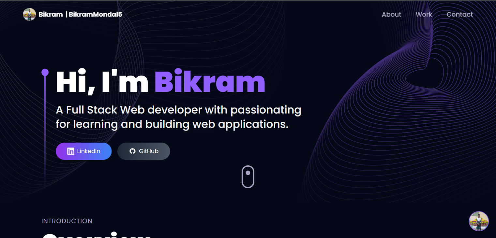

# 🚀 AI Portfolio | Interactive Web Experience

## 📋 Overview

This AI-powered portfolio is a cutting-edge web application that showcases my projects, skills, and experience in an interactive and engaging way. Leveraging the power of 3D visualization and artificial intelligence, this portfolio creates a memorable experience for visitors while effectively communicating my professional capabilities and creative vision.

## 👋 Introduction

Welcome to my AI-powered Portfolio! This project combines modern web development techniques with stunning 3D visualization to create an engaging, interactive showcase of my work. Whether you're a potential employer, collaborator, or fellow developer, I hope you enjoy exploring this digital representation of my skills and projects.

## 🤖🧠 Introducing Bikram.AI

The digital twin of myself. Bikram.AI is my personalized AI assistant integrated directly into this portfolio. It's designed to enhance your browsing experience by providing instant information about my projects, skills, and professional background. 

Using advanced natural language processing, Bikram.AI can answer questions, highlight relevant work experiences, and even explain the technical aspects of my projects. Feel free to interact with the chat widget to experience the power of AI-assisted portfolio navigation!

## ✨ Key Features

- **🔮 Interactive 3D Models**: Immerse yourself in a world of realistic 3D models, including drones and laptops with detailed textures and fluid animations.
- **📱 Responsive Design**: Enjoy a seamless experience across all devices - from smartphones to ultrawide monitors.
- **🤖 AI-Powered Chat Widget**: Get immediate responses to your questions through an intelligent chat assistant powered by Google's Gemini API.
- **⚡ Dynamic Content**: Experience smooth transitions and captivating visual effects throughout the portfolio.
- **🚀 Performance Optimized**: Fast loading times and efficient rendering even with complex 3D elements.
- **🌓 Dark Mode**: Eye-friendly interface with automatic theme detection.
- **🎭 Project Showcase**: Detailed display of projects with links, descriptions, and technologies used.
- **📊 Skill Visualization**: Interactive representation of technical skills with visually appealing elements.

## 🛠️ Technologies Used

- **⚛️ Frontend Framework**: React.js with Vite for lightning-fast development
- **🎨 Styling**: Tailwind CSS for utility-first styling
- **🌐 3D Visualization**: Three.js for immersive 3D experiences
- **🔄 Motion Graphics**: Framer Motion for smooth animations
- **🧠 AI Integration**: Google Gemini API for intelligent interactions
- **📨 Contact System**: EmailJS for hassle-free communication
- **📊 State Management**: React Context API for efficient state handling
- **🔄 Version Control**: Git for code versioning
- **☁️ Deployment**: Hosted on Vercel/Netlify for optimal performance
- **⚡ Optimization**: Lazy loading and code splitting for improved performance

## 📂 Project Structure

- `📱 src/components` - Reusable UI components
- `🖼️ src/assets` - Static assets including images and 3D models
- `⚙️ src/constants` - Application constants and configuration
- `🔧 src/utils` - Utility functions and helpers

## 📬 Contact

Feel free to reach out to me through any of the following channels:

- **✉️ Email**: [codesnippets45@gmail.com](mailto:codesnippets45@gmail.com)
- **💼 LinkedIn**: [Bikram Mondal](https://www.linkedin.com/in/bikram-mondal-a2bb18343)
- **💻 GitHub**: [BikramMondal5](https://github.com/BikramMondal5)
- **🐦 Twitter**: [@CSnippets62428](https://x.com/CSnippets62428)

Or simply use the contact form on my portfolio website to send me a message directly. I'm always open to discussing new projects, opportunities, or just connecting with fellow developers!

---

*Built with ❤️ and a passion for creating exceptional web experiences.*
