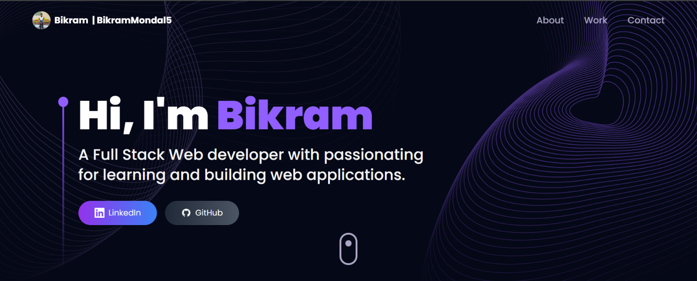

# 🤖✨ AI Portfolio




## 👋 Introduction

Welcome to my AI-powered Portfolio! This project combines modern web development techniques with stunning 3D visualization to create an engaging, interactive showcase of my work. Whether you're a potential employer, collaborator, or fellow developer, I hope you enjoy exploring this digital representation of my skills and projects.

## 🌟 Key Features

- **Interactive 3D Models**: Immerse yourself in a world of realistic 3D models, including drones and laptops with detailed textures and fluid animations.
- **Responsive Design**: Enjoy a seamless experience across all devices - from smartphones to ultrawide monitors.
- **AI-Powered Chat Widget**: Get immediate responses to your questions through an intelligent chat assistant powered by Google's Gemini API.
- **Dynamic Content**: Experience smooth transitions and captivating visual effects throughout the portfolio.
- **Performance Optimized**: Fast loading times and efficient rendering even with complex 3D elements.

## 🛠️ Technologies Used

- **Frontend Framework**: React.js with Vite for lightning-fast development
- **Styling**: Tailwind CSS for utility-first styling
- **3D Visualization**: Three.js for immersive 3D experiences
- **Motion Graphics**: Framer Motion for smooth animations
- **AI Integration**: Google Gemini API for intelligent interactions
- **Contact System**: EmailJS for hassle-free communication

## 🚀 Getting Started

### Prerequisites

- Node.js (v16.0 or higher)
- npm or yarn

### Installation

1. Clone the repository:
   ```bash
   git clone https://github.com/your-username/AI-portfolio.git
   ```

2. Navigate to the project directory:
   ```bash
   cd AI-portfolio
   ```

3. Install dependencies:
   ```bash
   npm install
   # or if you prefer yarn
   yarn
   ```

4. Set up environment variables:
   ```bash
   cp .env.example .env
   ```
   Then edit the `.env` file with your API keys and configuration.

5. Start the development server:
   ```bash
   npm run dev
   # or
   yarn dev
   ```

6. Open your browser and visit `http://localhost:5173` to view the portfolio.

## 🎯 Project Structure

- `src/components` - Reusable UI components
- `src/assets` - Static assets including images and 3D models
- `src/constants` - Application constants and configuration
- `src/utils` - Utility functions and helpers

## 💡 Why This Portfolio Stands Out

- **Blend of Art and Technology**: Demonstrates the beautiful intersection of creative design and technical implementation.
- **Performance-Focused**: Optimized for speed and efficiency, even with complex 3D rendering.
- **Interactive Experience**: Goes beyond static content to create memorable user interactions.
- **Professional Presentation**: Showcases work in a polished, industry-standard format.

## 🤝 Contributing

Feedback and contributions are welcome! If you have ideas for improvement or would like to collaborate, please:

1. Fork the repository
2. Create a feature branch (`git checkout -b feature/amazing-feature`)
3. Commit your changes (`git commit -m 'Add some amazing feature'`)
4. Push to the branch (`git push origin feature/amazing-feature`)
5. Open a Pull Request

## 📝 License

This project is licensed under the MIT License - see the `LICENSE` file for details.

## 📬 Contact

Have questions or want to connect? Reach out through the contact form on the portfolio or connect with me directly through my socials.

---

*Built with ❤️ and a passion for creating exceptional web experiences.*
